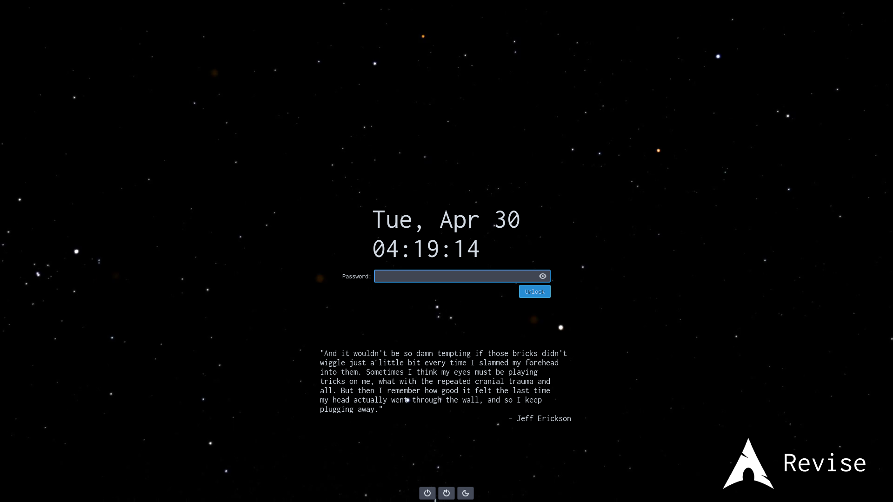

# dotfiles

## Note

If you're looking for the LuaSnip Guide: [website](https://evesdropper.dev/files/luasnip/) or [readme](https://github.com/evesdropper/dotfiles/tree/main/nvim/luasnip)

 

Some dotfiles on Arch Linux. Wayland-based configuration.

## Setup
Some basic information about my setup.
- OS: Arch Linux
- Window Manager: Sway
    * Status Bar: Waybar
    * Screen Lock: gtklock
- Terminal: kitty
- Shell: zsh
- File Manager: lf
- Text Editor: Neovim
- Web Browser: A mix of qutebrowser and hardened Firefox (modified with [Narsil's `user.js`](https://codeberg.org/Narsil/user.js) and [Cascade](https://github.com/cascadefox/cascade))

### Install?
No, I don't think so. I probably should make an install script, mostly for when I have to work on Windows.

## Serious To Do
- [ ] System: Wifi Setup (Eduroam)
- [ ] LaTeX: update preamble.
- [ ] General (Neovim/LuaSnip): create snippets/commands/keybinds for software development.
- [ ] General: find a stupid task to do such as making a script to generate quotes.

## Cool Stuff
Sure. I currently have a nice (new, gtklock) lockscreen, and that's about it.

## Serious Stuff
Startpage is a clone of [hawk](https://github.com/itsvs/hawk) with some personal changes added.

Lockscreen quote from [here](https://academia.stackexchange.com/questions/2219/how-should-i-deal-with-becoming-discouraged-as-a-graduate-student/2221#2221).
