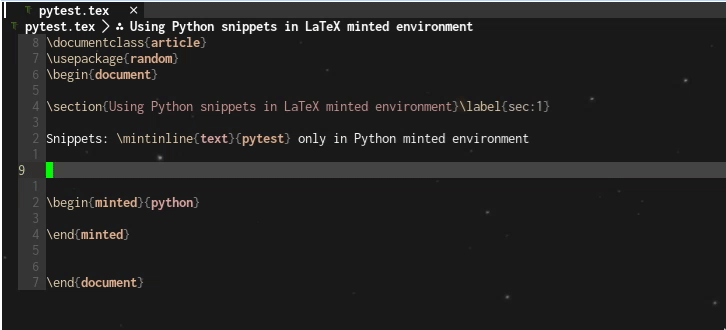
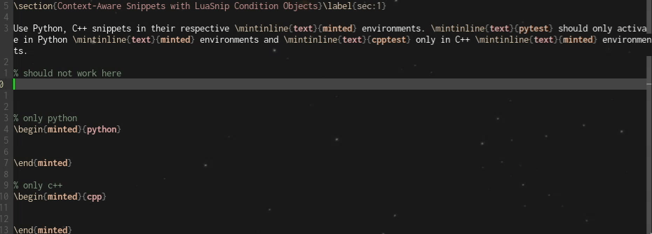

# LuaSnip Condition Objects: Use Python snippets within LaTeX Code Listings

## Acknowledgements/Notes

Thanks to lervag on Github for continued help on the VimTeX syntax reference.

**Status Update:** I finally got GIFs (and screenkeys - well, only in the second GIF) to work!

## Motivation

Aside from using LaTeX for math typesetting, there are some other use cases where I might draft up small things in code or add little code snippets. For example, in my numerical analysis course, for the programming assignment write-ups, we needed to answer some short questions and insert the code we had for the assignment.

It would be really nice to be able to use snippets from other languages when inserting code listings to make the process faster. This first step can easily be achieved by adding `ls.filetype_extend()` to your config. However, adding new snippet files means more triggers to watch out for and more places where snippets can be easily overloaded, leading to mistakes and errors.

But with VimTeX syntax highlighting and LuaSnip Condition Objects, we can implement a simple workaround that allows you to use filetype snippets only when you need them.

## Setup and Snippet Creation

> This assumes you have some sort of setup for LuaSnip (and a bit of familiarity with how snippets work) already; if not, it will be a good idea to check out my [guide](/files/luasnip/) which touches upon the basics of LuaSnip.

Let's start by setting up the `ls.filetype_extend()` configuration for LaTeX. The syntax is generally `ls.filetype_extend(<original filetype>, { <table of other filetypes> })`. For example, if I wanted to use LaTeX and Python, I would add the following to my Neovim config:

```lua
ls.filetype_extend("tex", { "python" })
```

Now onto the next part - creating snippets. Since we want to embed Python snippets in LaTeX, we'll be putting snippets in `python.lua`. I'm going to assume that you already know how to create snippets and have one on hand; I'll be using my Python test snippet as an example.

```lua
autosnippet('pytest', {t('this triggers only in python files, or in tex files with minted enabled')}),
```

If we use this snippet right now in LaTeX, it'll activate in any environment in the LaTeX document (as well as anywhere in Python), but we only want it to be present in `minted` environments. To do so, we'll have to implement some snippet conditions.

Let's summarize where we want our snippet to activate:

- Anywhere in Python files.
- Only in `minted` environment for LaTeX files.

We need to create conditions which allow us to implement this - conditions to detect the filetype, and another condition to detect the environment if we are in a LaTeX file. The former can be done with `vim.bo.filetype`, and the latter with the `env(name)` function we previously defined in the general LuaSnip guide. Here are our completed conditions.

```lua
local function tex()
    return vim.bo.filetype == "tex"
end

local function python()
    return vim.bo.filetype == "python"
end 

-- tex in python 
local function env(name) 
    local is_inside = vim.fn['vimtex#env#is_inside'](name)
    return (is_inside[1] > 0 and is_inside[2] > 0)
end

local function minted() 
    return env("minted")
end
```

To create something that works in the specified conditions, we could combine these functions to make a large function that does `(python or (tex and minted))`; however, with LuaSnip, we can use Condition Objects, which allow us to keep simple functions and combine conditions with a little boolean algebra.

### Condition Objects
Condition objects basically allow you to reuse base conditions and form more complex conditional expressions. To use them, add the following to your snippet file: 

```lua
local make_condition = require("luasnip.extras.conditions").make_condition
```

From there, we can now make each of our conditions an object, and using the expression we had for them earlier (`(python or (tex and minted))`), we can combine them together to form the condition.

> For more information on Condition Objects, see [release notes](https://github.com/L3MON4D3/LuaSnip/releases/tag/v1.1.0) for version 1.1.0.

```lua
local pyfile = make_condition(python)
local texfile = make_condition(tex)
local in_minted = make_condition(minted)

-- we want (pyfile or (texfile and minted))
-- like in boolean algebra, or is +, and is * 
-- new condition: pyfile + (texfile * in_minted)
```

With the new condition objects, our new snippet looks like so:

```lua
autosnippet('pytest', {t('this triggers only in python files, or in tex files with minted enabled')},
    { condition=pyfile + (texfile * in_minted), show_condition=pyfile + (texfile * in_minted) }),
```

This now should work in all Python files, while only triggering in `minted` environment in LaTeX - just what we wanted:



## Multiple Language Support 

Great, now this works on one language. But if I have a code block for 2 different languages, say Python and C++, then there would be issues with the two languages clashing with each other. To resolve this, we need to delve a little deeper into VimTeX syntax and make use of another syntax function - you can check if your cursor is a specific environment with `vimtex#syntax#in(<env>)`, giving us more specific results. This requires a few small tweaks to the previous condition function and yields the following:

```lua
local function mintedPython()
    return vim.fn['vimtex#syntax#in']("texMintedZonePython") == 1
end

-- keep previous code
local pyfile = make_condition(python)
local texfile = make_condition(tex)
local pymint = make_condition(mintedPython) -- for other languages, replace Python with the language name

autosnippet(
	"pytest",
	{ t("this triggers only in python files, or in tex files with minted enabled with python") },
	{ condition = pyfile + (texfile * pymint), show_condition = pyfile + (texfile * pymint) }
	),
```

I also added another C++ snippet in the GIF as a test - as intended, the Python snippet triggers only in Python `minted` environments and the C++ snippet only in C++ `minted` environments.



<hr>

Thanks for reading - hopefully you found it useful! The source code for the python snippet can be found [here](https://github.com/evesdropper/dotfiles/blob/main/nvim/luasnip/python.lua).
