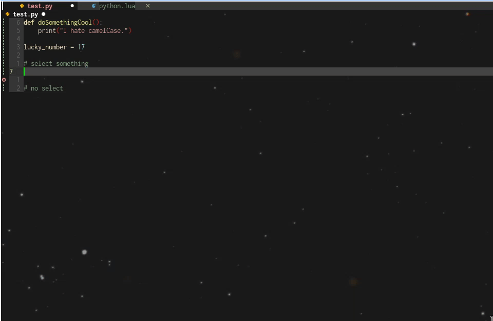
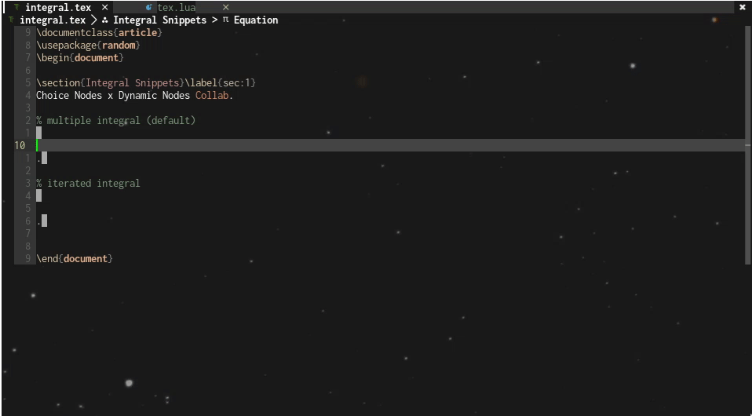
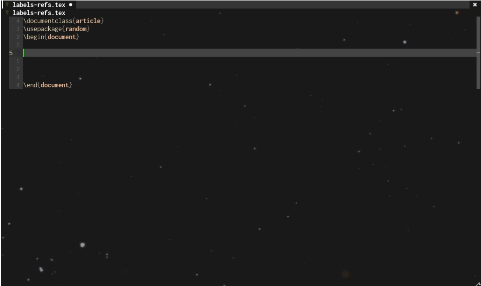

# Advanced LuaSnip: Modular Snippets with Choice/Dynamic Nodes

> :warning: This is a work in progress! Updates will be posted from time to time.

## Acknowledgement/Notes

This is a more advanced guide surrounding some of the specifics of LuaSnip I learned recently. To fully appreciate this, you need a fairly good understanding of LuaSnip; I'd recommend taking a look at my [general guide](https://github.com/evesdropper/dotfiles/tree/main/nvim/luasnip) which also has some more resources linked.

Additionally, while a majority of the snippets are for LaTeX (and one in Python), they can be adapted for any use case in other languages as well - I hope to have some snippets in other languages in the future. A majority of snippet development comes from using the language a lot and finding places where I can improve functionality; as I am taking more math-heavy courses, I'm mostly using LaTeX. Perhaps when I move to software engineering in the summer, I can pick up a new language and share new snippets.

### Updates
- 2023-02-04: This guide was created.

<hr>

I feel like I didn’t do choice and dynamic nodes as much justice as I should have in my original guide - these nodes are probably the two most useful parts of LuaSnip yet I ironically had the least to say about these features. Both provide *a lot* of modularity to the snippet-creation process, allowing you to reuse/modify a snippet based on your needs through means like regex captures and Dynamic Node's `user_args`. In this guide, I'll be going more in-depth on these nodes and providing a couple examples to showcase their power.

## Choice Nodes: Introducing Modularity
Initially, as an Ultisnips user, I found Choice Nodes to be quite useless - what could I really use them for? Eventually, I saw [this issue](https://github.com/L3MON4D3/LuaSnip/issues/618), which gave me the initial inspiration for some choice node use cases. While I had originally thought of choice nodes as something to switch between some choices (e.g. something like a color picker that switched through colors), I realized this applied to far more than a basic option switcher - this could be used to create modularity within snippets.

The whole idea of Choice Nodes is creating options for your snippets - instead of having two (or $\forall n \in \mathbb{N}, n > 1$ snippets, if you're into induction) very similar snippets perform very closely related tasks, a single snippet with a Choice Node could perform the same task. And as a bonus, it saves on your rather limited set of easy-to-use triggers.

Not sure what I mean? Let's go through a couple examples. Since these snippets are more straightforward, I'll also introduce some related side characters into the scene - the Snippet Node and Restore Node.

### Example 1: `minted` Delimiters - Modularity with Snippet Nodes

I like using the `minted` package to add code snippets into my LaTeX documents; however, sometimes we have something like the following:

```LaTeX
\mintinline{text}{this {} does not work!} % the } will cut off, and using \} will not work either
```
Fortunately, `minted` provides an alternate set of delimiters - the upright delimiters. So in most cases, I can just default to the first option, but if I know my code contains braces, I can switch over to the upright delimiters and have everything be fine. So here are my choices when creating this snippet:

- [Default Choice] Use `{<>}`, where the angle brackets denote an insert node, or `t("{"), i(1), t("}")`.
- Use `|<>|` as the alternate choice, or `t("|"), i(1), t("|")`.

You'll notice that for this choice node, we're dealing with multiple nodes - some text nodes and an insert node. As a choice node has the structure `c(index, {nodes})`, if we just directly insert the nodes, we would just be inserting a list of choices rather than a complete collection of nodes we want in the snippet.

Enter the **Snippet Node** - with `sn(nil, {nodes})`, we can comfortably fit all the nodes in the snippet node's node tables and have each choice be presented as the entire collection of nodes rather than have it degenerate into a scattered list of options. Additionally, since a Snippet Node is essentially a snippet, formatting with `fmt(a)` is also supported to keep your snippet looking nice and neat. 

With that being said, here's the final code:

```lua
-- idc if stylua doesn't like my code looking like this it's neat to me 
s({ trig = "qw", name = "inline code", dscr = "inline code, ft escape" },
    fmt([[
    \mintinline{<>}<>
    ]], { i(1, "text"), c(2, { sn(nil, { t("{"), i(1), t("}") }), sn(nil, { t("|"), i(1), t("|") }) }) },
    { delimiters = "<>" }
    )),
```

### Example 2: Set Overloading - Adding Restore Nodes

Another common snippet is creating a set in LaTeX math mode. There are a few ways to represent a set, as demonstrated below:

```LaTeX
\[
\{ 2, 3, \ldots \} % listing out the elements
\quad 
\{x \in \N \mid x > 1\} % set builder notation; one of my classes uses \colon and the other uses \mid which is another bridge we'll cross later
\]
```

$$\{ 2, 3, \ldots \} \quad \{x \in \mathbb{N} \mid x > 1\}$$

Thus we have two choices:

- [Default Choice]: Create a blank set with the power to insert anything, so a single insert node `i(1)`.
- Create a set with set builder notation with `\mid`, or something like this: `i(1), t(" \\mid "), i(2)`.

If we create a snippet using our current knowledge, and try to change choices midway through the insert node (e.g. we decide to list out the elements, then realize we could use set-builder instead), we lose the progress we made and have to start from scratch. How can we get this information back?

Use the **Restore Node**, which (re)stores text after the snippet has been updated. This is best used with Choice or Dynamic Nodes - all we need to do is replace the insert nodes with `r(1, "")` for everything to take effect. And with that, we have the final code:

```lua
autosnippet({ trig = "set", name = "set", dscr = "set" }, -- overload with set builder notation
	fmt([[
    \{<>\}<>
    ]], { c(1, { r(1, ""), sn(nil, { r(1, ""), t(" \\mid "), i(2) }) }), i(0) },
    { delimiters = "<>" }),
    { condition = math }
    ),
```

As a quick summary, here's a short list of when (not) to use Choice Nodes:
- **Do**: Use for adding a few optional choices, or when trying to build on to a more generalized snippet (e.g. docstrings, optional arguments are some solid choices).
- **Don't**: use it as a menu for multiple snippets, let alone unrelated snippets (e.g. making `greek` expand to a Choice Node containing all the Greek symbols in LaTeX). Remember, the idea is to build modularity, not to make a dropdown menu.

As you may have noticed, the previous examples seem bit tame. Let's spice it up by adding Dynamic Nodes into the mix.

## Dynamic Nodes: Leveling Up Your Snippets
Choice Node snippets may be a bit limited if we only deal with preset node outputs, but what if we could generate the output to custom fit our snippet? Enter the dynamic node.

I've said it once and I'll say it again - Dynamic Nodes are probably the single most powerful feature in LuaSnip. But with great power comes great responsibility (in this case, to read up and understand the documentation), and for this reason, Dynamic Nodes are also quite difficult to get accustomed to.

Like Choice Nodes, Dynamic Nodes can be broken down into one main idea: it generates custom snippet output as opposed to a singular node. Recall that a snippet is made up of multiple nodes, so essentially, it allows you to string together multiple nodes and return the result as a snippet node. That being said, if the return value of a potential snippet can be described as a snippet node, then you can make it happen with a Dynamic Node.

Well, in that case, how can we create and modify snippet nodes to our liking? Two common ways I use are captures with Lua Patterns (regex) and using the `user_args` argument of a Dynamic Node. Let's take a look at some examples:

### Example 1: Matrix Snippets - Regex Dynamic Snippets 

The reason I quit using LaTeX to typeset my homework back in Fall 2021 (when I had just started learning how to use LaTeX) was because of the endless matrices my linear algebra class had in its homework assignments. I later picked up (Neo)vim and UltiSnips and ended up finding snippets to create matrices to my liking. When I switched to LuaSnip last year, I was back to square one - no matrix snippets and another linear algebra course to deal with.

To combat this, I sought out to create a similar snippet to what I had in UltiSnips. The general idea of the snippet goes as follows:

- Use capture groups to determine the following: type of matrix (`bBpPv`), number of rows and columns, and augmented/regular matrix.
    * Type of matrix can be easily inserted, so it just uses a Function Node to append the argument to the matrix.
    * Similarly, augments can be easily programmed with a Function Node - just add the optional argument `[ccc|c]` for 4 columns.
    * However, the number of rows/columns not only directly affects the text output, it also affects the number of ~~insert~~ restore nodes - thus it needs a Dynamic Node. For example, a 3-column row would be something like `r(1), t(" & "), r(2), t(" & "), r(3), t(" \\\\")`, and if it were to have 3 rows, this would need to be repeated 3 times.
        + Our generating function should take in the row/column capture input, and create rows according to the number of columns, then repeat this process for the number of rows.

Filling in the implementation details, our snippet looks like this:

```lua
-- generating function
local mat = function(args, snip)
    local rows = tonumber(snip.captures[2])
    local cols = tonumber(snip.captures[3])
    local nodes = {}
    local ins_indx = 1 
    for j = 1, rows do 
        table.insert(nodes, r(ins_indx, tostring(j) .. "x1", i(1)))
        ins_indx = ins_indx + 1 
        for k = 2, cols do 
            table.insert(nodes, t(" & "))
            table.insert(nodes, r(ins_indx, tostring(j) .. "x" .. tostring(k), i(1))) 
            ins_indx = ins_indx + 1 
        end 
        table.insert(nodes, t({ " \\\\", "" }))
    end
    -- fix last node.
    nodes[#nodes] = t(" \\\\")
    return sn(nil, nodes)
end

s({ trig = "([bBpvV])mat(%d+)x(%d+)([ar])", regTrig = true, name = "matrix", dscr = "matrix trigger lets go", hidden = true },
    fmt([[
    \begin{<>}<>
    <>
    \end{<>}]], 
    {f(function(_, snip)
        return snip.captures[1] .. "matrix" -- captures matrix type
    end),
    f(function(_, snip)
        if snip.captures[4] == "a" then
            out = string.rep("c", tonumber(snip.captures[3]) - 1) -- array for augment 
            return "[" .. out .. "|c]"
        end
        return "" -- otherwise return nothing
    end),
    d(1, mat),
    f(function(_, snip)
        return snip.captures[1] .. "matrix" -- i think i could probably use a repeat node but whatever
    end),},
    { delimiters = "<>" }),
    { condition = math, show_condition = math }
),
```

### Example 2: Visual Python For Loop - Utilizing `user_args`

> Special thanks to [@medwatt](https://github.com/medwatt) for the inspiration behind this snippet.

Visual Mode snippets largely depend on the selected text. A while back, [@ejmastnak](https://github.com/ejmastnak) made a nice Dynamic Node snippet which allows the user to either use selected text or use an insert node. Let's build on that idea with custom preset text for the insert node depending on the context; which we can accomplish by adding `user_args`.

Here's the original function: 
```lua
local get_visual = function(args, parent)
    if (#parent.snippet.env.SELECT_RAW > 0) then
        return sn(nil, i(1, parent.snippet.env.SELECT_RAW))
    else  -- If SELECT_RAW is empty, return a blank insert node
        return sn(nil, i(1))
    end
end
```

All we need to do is add the `user_args` argument and add the following logic:

- If we have no `user_args` input, we can either input an empty string or a dummy string.
- Otherwise, we pass in the `user_args` input as default text, e.g. if we had `user_args={"luasnip"}`, then the resulting node would be `i(1, "luasnip")` instead.

This creates the following:

```lua
local get_visual = function(args, parent, _, user_args) -- third argument is old_state, which we don't use
    if isempty(user_args) then
        ret = "" -- edit if needed
    else
        ret = user_args
    end
    if #parent.snippet.env.SELECT_RAW > 0 then
        return sn(nil, i(1, parent.snippet.env.SELECT_RAW))
    else -- If SELECT_RAW is empty, return a blank insert node
        return sn(nil, i(1, ret))
    end
end
```

A possible use case is a visual for loop in Python. If something is selected, then it gets placed in a for loop; otherwise, the default for Python statements is `pass`, which can be passed in as the default string. All we need to do is place in the Dynamic Node and change `user_args` to what we want, and we have the final snippet:

```lua
autosnippet({ trig='vfor', name='trig', dscr='dscr'},
    fmt([[
    for <> in <>: 
        <>
    ]],
    { i(1), i(2), d(3, get_visual, {}, {user_args = {"pass"}}) }, -- leave the first table blank; that's for args which we are not using
    { delimiters='<>' }
    )),
```




As you've seen, Dynamic Nodes can unlock a whole new dimension in creating snippets. Let's expand on this even further by adding Choice Nodes back into the equation.

## Choice x Dynamic Nodes: The Collaboration We Needed
Now that we have two of the most powerful nodes in LuaSnip, let’s combine them together with a few examples to truly harness their power. Again, I'll provide an example with regex and one with `user_args`.

### Example 1: Integral Snippets
I honestly don't know why I came up with this snippet - I was working on something during break and thought to add snippets to help me with multiple integrals despite the fact that I don't think I'll be using multivariable calculus for a while. In general, I wanted a regex capture to take in the number of integrals we needed in total, then have it deal with two choices: iterated integrals and multiple integrals. Let's break down the cases:

- Iterated Integrals: We want something like `\int_{<>}^{<>}` repeated as many times as the user wants (call that `n`), as well as `n` iterations of `\dd <>` for the differential.
    * Since the number of text/insert nodes changes with `n`, we want to use a dynamic node to generate each of these outputs.
- Multiple Integrals: We want something like `\<>nt_{<>}`, where the first blank repeats `i` a total of $n$ times.
    * This can be easily resolved with a function node.

Using a similar structure to the matrix snippet, we end up with the following code:
```lua
-- integral functions
-- generate \int_{<>}^{<>}
local int1 = function(args, snip)
    local vars = tonumber(snip.captures[1])
    local nodes = {}
    for j = 1, vars do
	table.insert(nodes, t("\\int_{"))
	table.insert(nodes, r(2*j-1, "lb" .. tostring(j), i(1))) -- thanks L3MON4D3 for finding the index issue
	table.insert(nodes, t("}^{"))
	table.insert(nodes, r(2*j, "ub" .. tostring(j), i(1))) -- please remember to count and don't be like me
	table.insert(nodes, t("} "))
    end
    return sn(nil, nodes)
end

-- generate \dd <>
local int2 = function(args, snip)
    local vars = tonumber(snip.captures[1])
    local nodes = {}
    for j = 1, vars do
	table.insert(nodes, t(" \\dd "))
	table.insert(nodes, r(j, "var" .. tostring(j), i(1)))
    end
    return sn(nil, nodes)
end

autosnippet(
    { trig = "(%d)int", name = "multi integrals", dscr = "please work", regTrig = true, hidden = false },
    fmt([[ 
    <> <> <> <>
    ]],{c(1, { fmta([[
    \<><>nt_{<>}
    ]], {c(1, { t(""), t("o") }),
	f(function(_, parent, snip)
	    inum = tonumber(parent.parent.captures[1]) -- this guy's lineage looking like a research lab's
	    res = string.rep("i", inum)
	    return res
	end), i(2),}), d(nil, int1),}),
	i(2), d(3, int2), i(0),},
        { delimiters = "<>" }),
	{ condition = math, show_condition = math }),
```



### Example 2: Label Generation
I attended a LaTeX workshop at my university a while back, and I was introduced to the world of labels and references. And while taking notes for my abstract algebra course, I realized quickly that I needed something to keep track of propositions and theorems and cross-reference them. However, at the same time, I didn’t want labels to clutter my screen when I was just testing something out or writing up homework assignments.

A choice node took care of this problem easily; now I could add labels in a couple keypresses when needed while keeping them out of my screen for most general typesetting.

Now onto the labels. Generally, using `\label{<>}` would suffice for most cases; however, there were two changes I needed to implement:

- I also wanted more descriptions for my labels - e.g. `\section{}` labeled with `sec:#` and Definitions/Theorems with `def:#, thm:#` respectively.
    * This could be resolved using `user_args`, so `user_arg1` served as the source to collect label prefixes.
- `\label{<>}` did not make sense for the definition/theorem boxes made with `tcolorbox` - for those - I wanted to have a single optional argument `[<>]`.
    * Again, `user_args` came to the rescue, and I included a second option `xargs` (for the tcolorbox library) to denote that it would user a different set of opening/closing delimiters.

With that, here is the code and the snippet in action:
```lua
-- personal util 
local function isempty(s) --util 
    return s == nil or s == ''
end

-- label util 
local generate_label = function(args, parent, _, user_arg1, user_arg2)
    if user_arg2 ~= "xargs" then
        delims = {"\\label{", "}"} -- chooses surrounding environment based on arg2 - tcolorboxes use xargs
    else
        delims = {"[", "]"}
    end
    if isempty(user_arg1) then  -- creates a general label
        return sn(nil, fmta([[
        \label{<>}
        ]], {i(1)}))
    else  -- creates a specialized label
        return sn(nil, fmta([[
        <><>:<><>
        ]], {t(delims[1]), t(user_arg1), i(1), t(delims[2])}))
    end
end

-- generates \section{$1}(\label{sec:$1})?
s(
    { trig = "#", hidden = true, priority = 250 },
    fmt(
    [[
    \section{<>}<>
    <>]],
    { i(1), c(2, {t(""), d(1, generate_label, {}, {user_args={"sec"}} )
    }), i(0) },
    { delimiters = "<>" }
    )
),

-- generates \begin{definition}[$1]([def:$2])?{ ...
s(
    { trig = "adef", name = "add definition", dscr = "add definition box" },
    fmt(
    [[ 
    \begin{definition}[<>]<>{<>
    }
    \end{definition}]],
    { i(1), c(2, {t(""), d(1, generate_label, {}, {user_args={"def", "xargs"}})}), i(0) },
    { delimiters = "<>" }
    )
),
```



## Outro
Thanks for reading - I hope you learned something new and can find a way to implement these changes. Note that this guide is in no way comprehensive; rather, I just referenced techniques I commonly use as inspiration. If I find a new use case, I'll be sure to update this guide.
